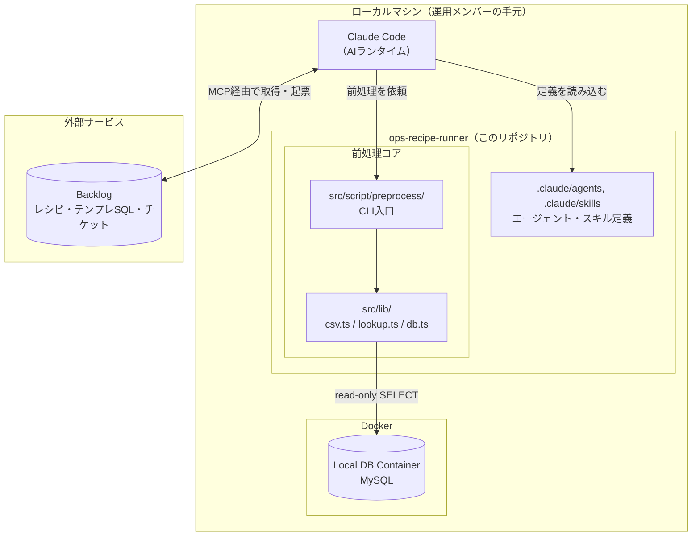
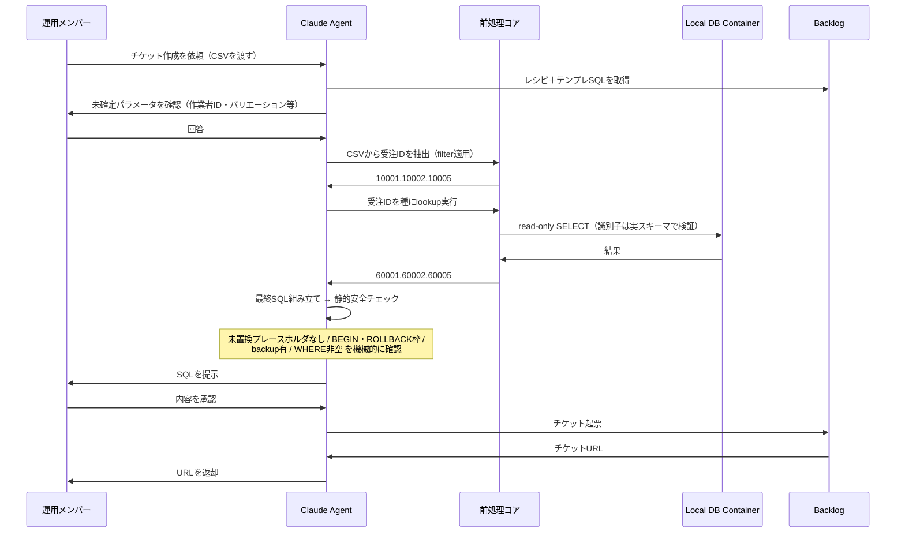

# ops-recipe-runner

運用メンバーが手作業で流している定型SQLを、入力CSVとテンプレートの `{{...}}` プレースホルダーから
**忠実に再現**し、Backlogチケットとして起票するAI駆動ワークフロー。

## 解決したい課題

フラグ更新や固定値更新のような定型SQLは、1本ずつは数分で終わる小さな作業。それでも運用メンバーは
毎回「CSVからIDを拾う → SQLに貼る → 関連テーブルのIDを引き直す → 転記する」を手で繰り返している。

つらいのは**作業時間そのものより、手入力の正確さを要求され続けることと、そのたびに集中が切れること**。
このプロジェクトの狙いは工数削減ではなく、**手入力の省略と、集中が細切れになる要因の除去**にある。
SQLの実行判断は人が持ったまま、その手前の機械的な作業だけを引き受ける。

## 何をするものか（実例）

「CSVで渡された受注のうち、出荷済みのものだけ営業担当を変更したい」というケース。

**入力**：運用メンバーが用意するCSV（ヘッダーは実務どおり日本語）

```csv
受注ID,出荷ステータス
10001,2
10002,2
10003,1
10004,1
10005,2
```

**中間処理**：前処理コアが2つの前処理を担う

```bash
# 出荷ステータス=2 の行だけに絞り、受注IDを抽出 → 10001,10002,10005
# （10003,10004 は未出荷のため対象外）

# 抽出した受注IDを種に、DBを2段辿って売上IDを取得 → 60001,60002,60005
# 受注ID → order_detail_id → sales_id
```

**出力**：Agentが組み立て、Backlogチケットとして起票されるSQL（抜粋）

```sql
set @salesUserId = 201;
set @salesUserName = 'teamB';
set @salesOfficeId = 3;

/*** backup: 更新前の値を退避 ***/
select * from t_order where order_id in (10001,10002,10005);

BEGIN;
UPDATE `t_order`
SET `sales_user_id` = @salesUserId, `sales_user_name` = @salesUserName, ...
WHERE `order_id` IN (10001,10002,10005);   -- 未出荷の 10003,10004 は含まれない

ROLLBACK;
-- COMMIT;   ← 実行判断は運用メンバーが行う
```

手入力していた「IDの抽出・転記」が消え、運用メンバーはチケット上で**業務として正しいかの確認だけ**を行う。
既定は `ROLLBACK` のままで、`COMMIT` への切り替えは必ず人間が判断する。

## 構成

物理的な配置は次のとおり。レシピとテンプレSQLは**このリポジトリではなくBacklog側**に置き、
運用メンバーがレビューできる状態に保つ。



| 構成要素 | 責務 |
| --- | --- |
| **Backlog** | レシピ＋テンプレSQLの保管（**正**）とチケット管理。運用メンバーがレビューする |
| **Claude Agent** | レシピ解釈・リテラル置換・日付計算・最終SQL組み立て・静的安全チェック・起票 |
| **前処理コア** | CSV解析とDB lookupのみ。テンプレSQL・レシピの実体は持たない |
| **Local DB Container** | lookup参照用のMySQL。クエリ内容は関知しない受動的なDB |

前処理コアの中身は3ファイルに閉じている。

- `src/lib/csv.ts` — 列抽出（`extractColumn`）・行フィルタ（`filterRows`）
- `src/lib/lookup.ts` — 宣言的lookupの汎用実行器（`runLookupSteps`）
- `src/lib/db.ts` — DB接続

## 処理の流れ

上記の実例（CSV＋lookupを伴うケース）を時系列にすると次のようになる。



用語に迷ったら [`doc/glossary.md`](doc/glossary.md)、他パターン（リテラルのみ／CSVのみ）は
[`doc/operation-pattern-example.md`](doc/operation-pattern-example.md) を参照。

## セットアップ

### 前提

- Node.js（TypeScriptは `tsx` で直接実行するためビルド不要）
- Docker（ローカルMySQLを使う場合）

### 1. インストールと環境変数

`.env` は `docker compose` の起動に必須のため、**最初に作成する**（既定値のままで動く）。

```bash
npm ci
cp .env.example .env
```

### 2. ローカルDB（Local DB Container）の起動

```bash
docker compose up -d db
```

初回起動（ボリュームが空の時）は `docker/mysql/init/000_bootstrap.sh` が
`docker/mysql/dump/latest.sql` の有無を判定し、あれば復元、無ければ既定のスキーマ/seed
（`docker/mysql/init/default/`）を適用する。作り直す場合は
`docker compose down -v && docker compose up -d db`。

### 3. 動作確認

```bash
npm test                 # 単体テスト（DB不要）
npm run test:integration # 結合テスト（上記のDB起動が前提）
```

### 4. Backlog連携（レシピ・チケット運用を行う場合）

レシピとテンプレSQLはBacklogのドキュメントに置くため、ワークフローを動かすにはBacklog MCPの接続が必要。
前処理CLIとテストだけを試す場合は、この手順は不要。

```bash
cp .mcp.json.example .mcp.json
```

`.mcp.json` を開き、2つの値を設定する（このファイルはAPIキーを含むためgitignore対象）。

| キー | 取得場所 |
| --- | --- |
| `BACKLOG_DOMAIN` | 利用中のスペースのURL（例: `your-space.backlog.com`） |
| `BACKLOG_API_KEY` | Backlogの「個人設定 → API」から発行 |

設定後、Claude Code の `/mcp` で接続状態を確認する。

### 5. グローバル化（任意のディレクトリから使う場合）

運用メンバーはタスクごとに作業用ディレクトリを作り、そこからワークフローを開始する。
この使い方をするには、スキルとエージェント定義を `~/.claude/` から参照できるようにする。

```bash
export REPO="$(pwd)"
mkdir -p ~/.claude/skills ~/.claude/agents

# スキル（ディレクトリ1本。中身は自動追随）
ln -s "$REPO/.claude/skills/ops-recipe-runner" ~/.claude/skills/ops-recipe-runner

# エージェント定義（6体）
for a in requirements-analyst designer implementer tester documenter reviewer; do
  ln -s "$REPO/.claude/agents/recipe-$a.md" ~/.claude/agents/recipe-$a.md
done
```

**シンボリックリンクにする理由**：実体はこのリポジトリ側に残るため、`git pull` した内容が
そのまま反映され、二重管理にならない。`~/.claude/skills` `~/.claude/agents` は実ディレクトリの
まま残すこと（ディレクトリごとリンクすると、他のグローバル定義を置いた際にこのリポジトリへ
書き込まれてしまう）。

次に、リポジトリの場所をスキルへ伝えるため `~/.claude/settings.json` に環境変数を追加する。

```json
{
  "env": {
    "OPS_RECIPE_RUNNER_HOME": "/absolute/path/to/ops-recipe-runner"
  }
}
```

これで任意のディレクトリから `/ops-recipe-runner` を起動できる。入力CSVはワークスペースに置いたまま
渡せばよく、Agentがリポジトリの `work/`（gitignore済み）へ配置してから前処理を実行し、
完了後に削除する。要件シート・設計書などの成果物はリポジトリ配下へ集約される。

## 使い方（CLI）

前処理はレシピの `handler` に対応する2つの汎用CLIとして提供される。実際の呼び出しは
Agentがレシピの宣言から組み立てる想定だが、単体で動作確認する場合は以下。

```bash
# preprocess-csv: CSVの指定列をカンマ区切りで抽出（filterは任意、"列名 = 値" の1条件のみ）
npm run preprocess:extract-column -- <csvPath> <column> [filter]

# preprocess-lookup: 宣言的lookup(steps)をJSONで渡し、最終ステップの値をカンマ区切りで取得
npm run preprocess:run-lookup -- '<steps-json>' <ids-カンマ区切り>
```

具体的な入出力例・バリデーション仕様は [`doc/preprocess-core-spec.md`](doc/preprocess-core-spec.md) を参照。

## テスト

```bash
npm test                # 単体（純粋な前処理。*.integration.test.ts は除外）
npm run test:integration  # 結合（lookup×DB。docker compose up -d db が前提）
```

方針は [`doc/testing-policy.md`](doc/testing-policy.md)。受入（生成SQLの忠実性）・日付計算は
コードでなく Agent の確認観点で担保する（コードのテスト対象外）。確認済み範囲のまとめは
[`doc/test-summary.md`](doc/test-summary.md)。

## 運用ワークフロー

新しい定例の作成・修正・実行は `.claude/skills/ops-recipe-runner/`（ルータースキル）から入る。
意図（作成/修正/チケット新規/SQL追記）に応じて `.claude/agents/` のフェーズ担当エージェントへ
振り分けられる。

| フェーズ | 担当 | 主な成果物 |
| --- | --- | --- |
| 要件 | recipe-requirements-analyst | `doc/requirements/<name>/<name>.md` |
| 設計 | recipe-designer | `doc/requirements/<name>/design.md` |
| 実装 | recipe-implementer | 前処理コード（必要時のみ） |
| テスト | recipe-tester | vitest（単体＋結合） |
| ドキュメント | recipe-documenter | Backlogレシピ／運用ドキュメント |
| レビュー | recipe-reviewer | 最終ゲート |

## ドキュメント

| ドキュメント | 内容 |
| --- | --- |
| [`CLAUDE.md`](CLAUDE.md) | プロジェクトの目的・価値観・アーキテクチャ・運用ワークフロー全体 |
| [`doc/glossary.md`](doc/glossary.md) | 用語集（正準の呼称） |
| [`doc/recipe-format.md`](doc/recipe-format.md) | レシピの正準フォーマット（プレースホルダー・lookup宣言等） |
| [`doc/preprocess-core-spec.md`](doc/preprocess-core-spec.md) | 前処理コアの機能仕様・入力バリデーション仕様（オペレータ向け） |
| [`doc/operation-pattern-example.md`](doc/operation-pattern-example.md) | 具体的なオペレーションパターン例 |
| [`doc/testing-policy.md`](doc/testing-policy.md) | テスト方針（V字モデル） |
| [`doc/test-summary.md`](doc/test-summary.md) | 確認済みテスト範囲のサマリー（単体・結合・シナリオ検証） |
| `doc/architecture/` | レシピ作成（`recipe-creation.md`）・チケット実行（`ticket-workflow.md`）のシーケンス |
