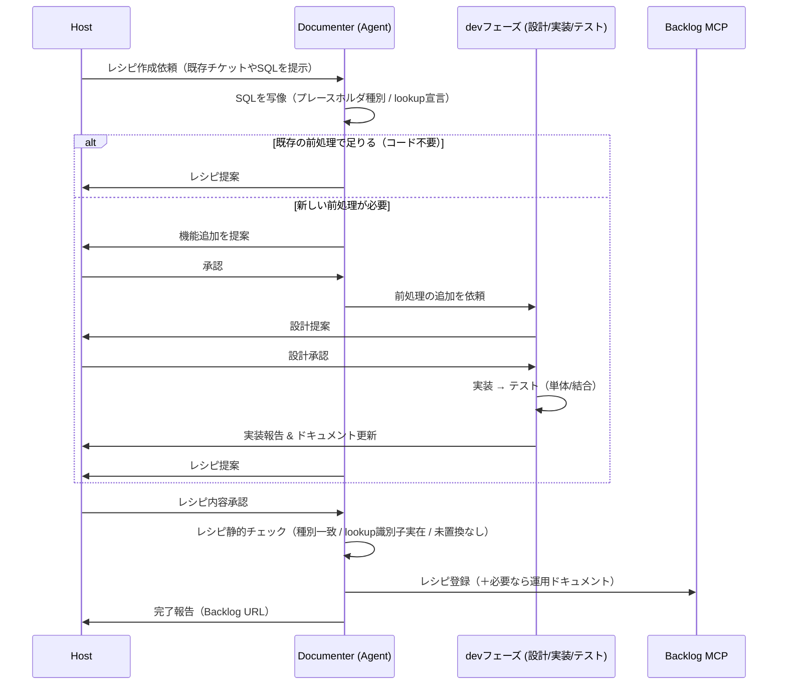

# レシピ作成フロー（新規レシピの作成 / 構想）

> ステータス: **構想段階**。これは**新規レシピを作る**シナリオ。
> 既存レシピから**チケット(SQL)を生成・起票する**実行シナリオは `doc/architecture/ticket-workflow.md`（別物）。

## レシピのライフサイクル（2つのシナリオ）

| シナリオ | 内容 | 主担当 | ドキュメント |
| --- | --- | --- | --- |
| 作成 | 手作業SQL/既存チケットから新しいレシピを起こす | ドキュメンター | 本書 |
| 実行 | 既存レシピからチケット(SQL)を生成・起票する | Agent（実行時に Script Runner が前処理） | `ticket-workflow.md` |

## 概要

Host が「このSQL/チケットをレシピ化したい」と依頼。ドキュメンターが手作業SQLを写像し
（プレースホルダ種別 / lookup宣言）、**既存の前処理で足りるか**を判断する。足りればそのままレシピ提案。
足りなければ、新しい前処理の追加（設計→実装→テスト）を挟んでからレシピ提案。承認後、
**レシピ静的チェック**を通して Backlog に登録する。

## 分岐の要点

- **コードを増やさないのが基本**。既存の前処理（`csv.ts` の CSV抽出、`queries.ts` の lookup）で
  成立するなら、コード追加せずレシピだけ作る。
- **新しい前処理が必要なときだけ** devフェーズ（設計/実装/テスト担当）を通す。
  ここで登場する `dev` は開発時のエージェント群であり、実行時ランタイムの Script Runner とは別物。
- レシピは**機械（Agent）が読む**ので、Backlog 登録前に**レシピ静的チェック**を必ず通す。

## シーケンス

> 実行時ランタイムの Script Runner は**この作成フローには登場しない**。後の実行フロー
> （`ticket-workflow.md`）で lookup を走らせる役として登場する。

## レシピ静的チェック項目（Backlog 登録前）

機械が読むレシピの妥当性を、登録前にドキュメンターが検証する（SQL側の静的安全チェックと対になる）。

- プレースホルダの種別（リテラル=Agent / データ由来=前処理）が `design.md` と一致している。
- lookup宣言の識別子（`from` / `select` / `key`）が**実スキーマに存在**する（allowlist整合）。
- テンプレに未置換の `{{...}}` が残らない構造になっている。
- 更新系なら、実行時に静的安全チェック（`BEGIN/ROLLBACK`・空WHERE無し・backup）を通せる枠を持つ。
