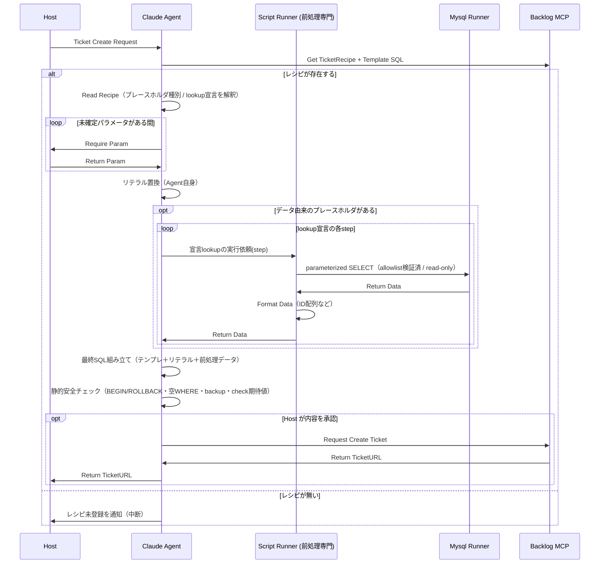

# チケット作成ワークフロー（アーキ方針 / 構想）

> ステータス: **構想段階**。現行実装（`src/script/routine/<name>/` の `script.ts` ＋ repo 内 `*.template.sql`）は
> 当面そのまま。本書は将来像の合意メモ。

## 概要

運用メンバー（Host）の依頼を起点に、Agent が Backlog のレシピとテンプレSQLを読み、パラメータを確定し、
前処理（CSV抽出・lookup）を経て最終SQLを組み立て、Backlog にチケットとして起票する。

狙いは工数削減ではなく、**手入力の省略と集中の分断の除去**（`CLAUDE.md` の目的を参照）。

## 登場人物と責務

| 登場人物 | 責務 |
| --- | --- |
| Host（運用メンバー） | 依頼・パラメータ提供・内容承認。業務妥当性のレビュー |
| Claude Agent | レシピ解釈・リテラル置換・前処理のオーケストレーション・最終SQL組み立て・静的安全チェック・起票 |
| Script Runner（前処理専門） | 宣言に基づく汎用 lookup 実行（read-only）。SQLテンプレは持たない |
| Mysql Runner | DB 起動・SELECT 実行 |
| Backlog MCP | レシピ／テンプレSQLの保管（正）・チケット起票 |

## 決定事項

### 1. 更新用テンプレSQL は Backlog が正（人手レビュー）
- 運用SQLはメンバーが責任を持ってレビューする。**テンプレ変更を起点に Agent がレシピを書き直す**運用。
- repo から出るぶん機械チェックが自動で掛からないため、下記「静的安全チェック」で補う。

### 2. プレースホルダの2分類（レシピの契約）
| 種別 | 例 | 埋める人 | ソース |
| --- | --- | --- | --- |
| リテラル | `{{userId}}` `{{baseDate}}` `{{salesUserId}}` | Agent | パラメータ / レシピ定義 |
| データ由来 | `{{orderIds}}` `{{salesIds}}` | Script Runner | CSV列 / lookup宣言 |

### 3. lookup は「宣言的な汎用実行器」
生SQLをレシピに直書きせず、レシピは**引き方を宣言**し、実行器が安全に組み立てる。

```yaml
lookups:
  - name: salesIds            # → {{salesIds}} に入る
    steps:
      - from: t_order_detail
        select: order_detail_id
        key: order_id
        keySource: csv:order_id       # CSVの列を種にする
        filters: [logical_delete_flag = 0]
      - from: t_sales
        select: sales_id
        key: order_detail_id
        keySource: prevStep           # 前段の結果を種にする（多段lookup）
        filters: [logical_delete_flag = 0]
```

実行器の性質:
- 各 step を `select group_concat(distinct {select} separator ',') from {from} where {key} in ({vals}) [and {filters}]` として実行。
- **read-only**。`{vals}` のみ値としてパラメータ化。
- `from` / `select` / `key` の**識別子はスキーマ allowlist で検証**（MySQLは識別子をバインドできないため、実在テーブル/列に限定してインジェクションを塞ぐ）。
- 多段 lookup は `steps` の連鎖で表現（現行 `fetchSalesIds` の `order_id → order_detail_id → sales_id` もこれで表せる）。
- 実行器は repo に1つ、単体テストを集約。新規 lookup は「レシピに宣言を足すだけ」でコード追加不要。

### 4. Agent による静的安全チェック（起票前）
最終SQL組み立て後、チケット化の前に形式面を機械チェック:
- `BEGIN;` と `ROLLBACK/COMMIT` の枠がある
- 更新前の backup select がある
- `WHERE` が空でない（全件更新事故の防止）
- check クエリの期待値（0件など）が明記されている
- **未置換プレースホルダが残っていない**（`{{...}}` が1つも無い）
  ※ 旧 `renderTemplate` はこの検知をコードで担っていた。置換をAgentが担うようになったため、
    起票前チェックとして必ず確認する。

→ 人＝業務妥当性 / Agent＝形式安全性 の二段構え。

### 5. Agent が担う日付計算の確認観点
日付（締日・入金予定日など）の算出は Agent が担う。テンプレの日付は膨大にならない前提だが、
**過去に実際に踏んだ祝日バグ**を再発させないため、Agent が日付を出したら次を必ず確認する:

- **週末・祝日の繰り上げ**: 「◯営業日後」は土日・日本の祝日を跨いだら翌営業日へ繰り上がっているか
  （例: 翌月初+14営業日が土曜 → 翌月曜）。
- **同日仕様**: 入金予定日と入金猶予日は同日、など要件どおりか。
- **月の起点**: 「翌月初」等の起点月がズレていないか（処理月 vs 翌月）。
- **表記**: `YYYY-MM-DD` で、SQL上はクォート付きの日付リテラルになっているか（数値計算に化けていないか）。

> 背景（過去の事故）: JSの `Date` でローカル/UTCの系統を混ぜて日付が1日ズレた／`'2026-07-15'` を
> クォート無しで書き `2026-7-15=1998` の数値計算になった、等。Agent算出でも同じ観点で確認する。

## シーケンス



## 現行方式との関係

- 現行: `script.ts` が テンプレ読込・CSV解析・lookup・置換・出力を一手に担う（1定例＝1スクリプト）。
- 将来: テンプレは Backlog、lookup は宣言＋汎用実行器、置換は Agent。Script Runner は前処理専門に痩せる。
- 移行は段階的に判断（本書は方針合意のみ）。
