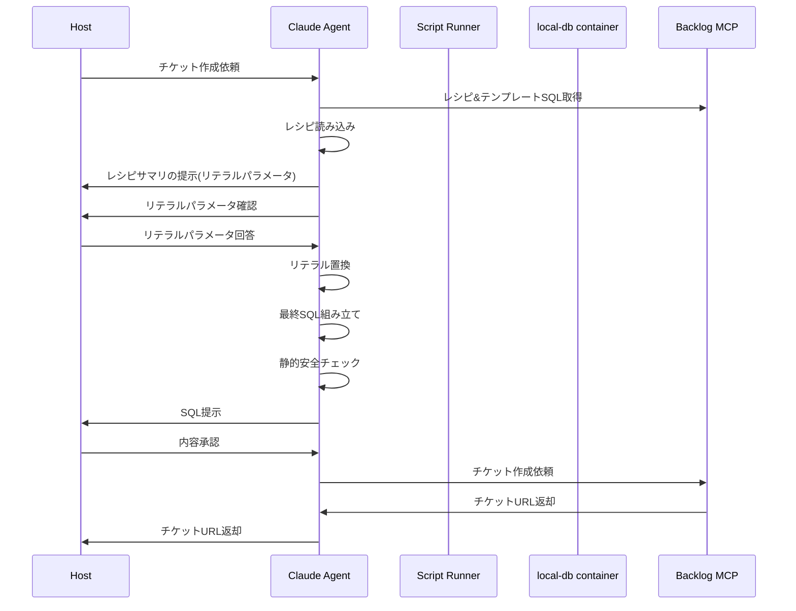
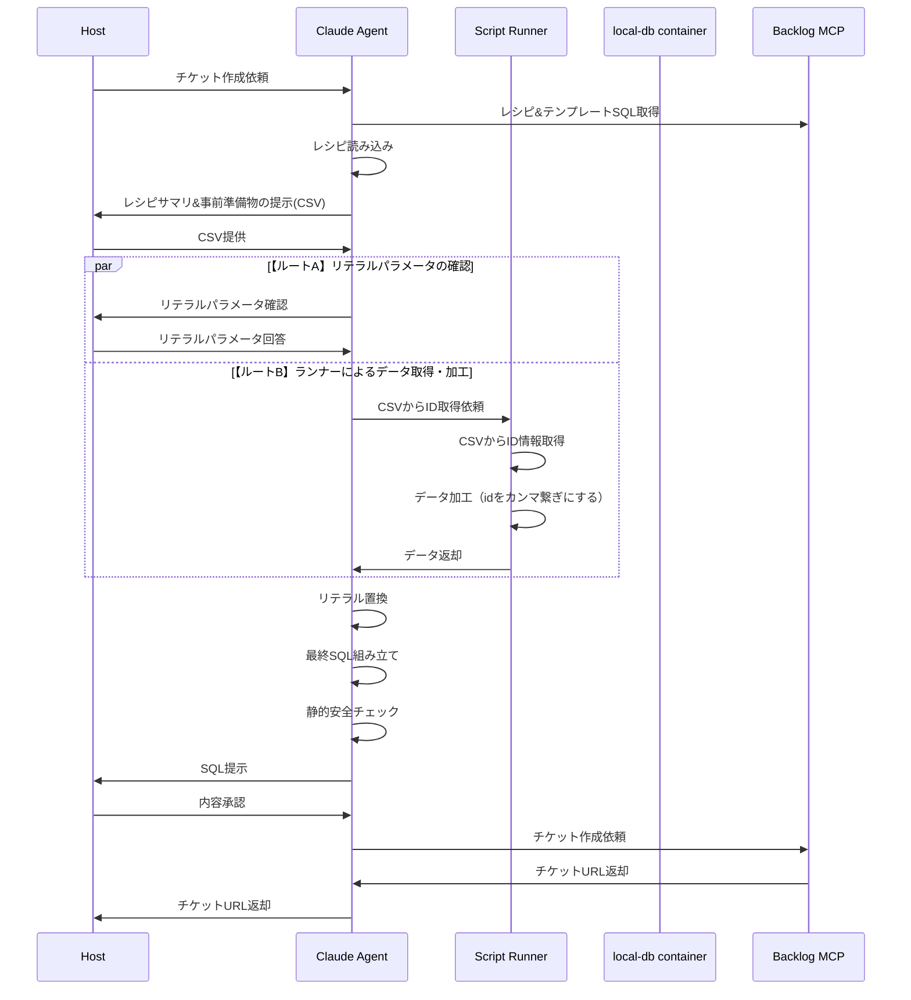
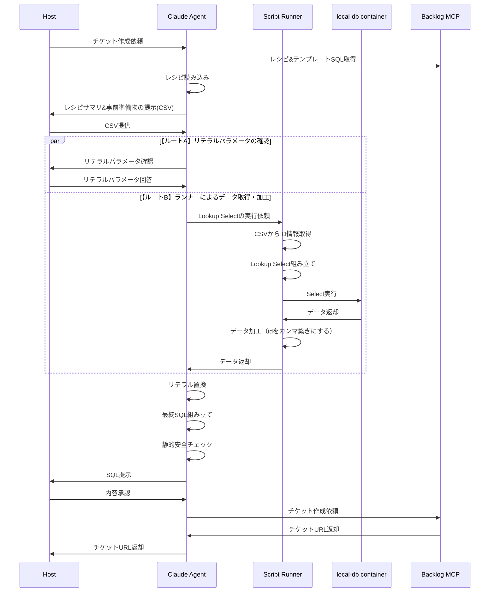

## プレースホルダーの置換パターン

**方針**

- 簡単な置換はAgentがそのまま実施する
- 前処理を必要とする内容はScript Runnerが受け持つ

| #   | use case               | Agent | Script Runner | local-db container |
| :-- | :--------------------- | :---- | :------------ | :-------------- |
| 1   | リテラル置換のみ(日付) | yes   | no            | no              |
| 2   | CSVからID取得          | no    | yes           | no              |
| 3   | DBからID取得           | no    | yes           | yes             |

## ユースケース

### リテラル置換

**プレースホルダー**

| #   | place holder | replaced(example) | NOTE |
| --- | ------------ | ----------------- | ---- |
| 1   | fromDate     | 2026-08-01        |      |
| 2   | toDate       | 2026-08-31        |      |

**テンプレート**

```sql
/***
* データ抽出
* ---
* ある期間中のデータを抽出する
* ---
* - 抽出期間: 出荷日が7月中
*     example:
*      - from: 2026-07-01
*      - to: 2026-07-31
*/
set @fromDate = '{{fromDate}}';
set @toDate = '{{toDate}}';

select
  *
from
  t_shipping
where
  shipment_date between @fromDate and @toDate;


```

**シーケンス**



### リテラル置換 + CSV

**プレースホルダー**

| #   | place holder  | handler       | description                            | replaced(example)    |
| --- | ------------- | ------------- | -------------------------------------- | -------------------- |
| 1   | salesUserId   | Agent         | レシピのバリエーションを参照し置換する | 101                  |
| 2   | salesUserName | Agent         | レシピのバリエーションを参照し置換する | teamA                |
| 3   | salesOfficeId | Agent         | レシピのバリエーションを参照し置換する | 5                    |
| 4   | userId        | Agent         |                                        | 1018                 |
| 5   | orderIds      | Script Runner | CSVから受注IDを取得し`orderIds`を作成  | 37304,37387,3125,... |

> 実務CSVのヘッダーは日本語表記（受注ID = DBの order_id に対応）。

**CSV**

```
受注ID,出荷ID,ステータス,出荷日時,追跡番号
10001,20001,shipped,2026-06-10 14:30:00,TRK-ABC123
10002,20002,shipped,2026-06-10 15:00:00,TRK-DEF456
10003,20003,shipped,2026-06-11 09:15:00,TRK-GHI789
10004,20004,shipped,2026-06-11 10:45:00,TRK-JKL012
10005,20005,shipped,2026-06-12 13:00:00,TRK-MNO345
```

**テンプレート**

```sql
/***
* CSVを元にデータ更新
* ---
* 受注データ変更
* ---
* - 更新キー: CSVから取得した受注ID
*     - ids: {{orderIds}}
* - 更新情報:
*     - 担当情報:
*       - sales_user_id
*       - sales_user_name
*       - sales_office_id
*     - オペレーション担当情報
* - 更新バリエーション:
*     - A
*       - sales_user_id: 101
*       - sales_user_name: teamA
*       - sales_office_id: 5
*     - B
*       - sales_user_id: 201
*       - sales_user_name: teamB
*       - sales_office_id: 3
*     - C
*       - sales_user_id: 301
*       - sales_user_name: teamC
*       - sales_office_id: 2
*
*/

set @salesUserId = {{salesUserId}};
set @salesUserName = '{{salesUserName}}';
set @salesOfficeId = {{salesOfficeId}};

set @userId = {{userId}};
set @updateDatetime = now();

/***
* backup
*/
select * from t_order
where order_id in ({{orderIds}});


/***
* update
*/
-- -----
BEGIN;
-- -----

UPDATE `t_order`
SET
  `sales_user_id` = @salesUserId,
  `sales_user_name` = @salesUserName,
  `sales_office_id` = @salesOfficeId,
  `update_datetime` = @updateDatetime,
  `update_user_id` = @userId
WHERE
  `order_id` IN ({{orderIds}});

-- -----
ROLLBACK;
-- COMMIT;
-- -----

```

**シーケンス**



### リテラル置換 + CSV + Lookup Select

**プレースホルダー**

| #   | place holder   | handler       | description                                          | replaced(example)    |
| --- | -------------- | ------------- | ---------------------------------------------------- | -------------------- |
| 1   | newCloseDate   | Agent         | 元々の締日翌月1日（対象締月7月の場合は8月1日を指定） | 2026-08-01           |
| 2   | newDepositDate | Agent         | 新締日から2週間後の翌営業日を指定                    | 2026-08-17           |
| 3   | userId         | Agent         |                                                      | 1018                 |
| 4   | invoiceIds     | Script Runner | CSVの受注IDをキーにDBから取得(Lookup Select)         | 27304,27387,3125,... |

> 中間の `orderIds`（CSV由来）は Lookup Select 内で使う内部中間値。二段置換（CSV→orderIds→lookup→invoiceIds）。
> 実務CSVのヘッダーは日本語表記（受注ID = DBの order_id に対応）。

**CSV**

```
受注ID,出荷ID,ステータス,出荷日時,追跡番号
10001,20001,shipped,2026-06-10 14:30:00,TRK-ABC123
10002,20002,shipped,2026-06-10 15:00:00,TRK-DEF456
10003,20003,shipped,2026-06-11 09:15:00,TRK-GHI789
10004,20004,shipped,2026-06-11 10:45:00,TRK-JKL012
10005,20005,shipped,2026-06-12 13:00:00,TRK-MNO345
```

**Lookup Select**

```sql
/***
* 受注ID: CSVの`受注ID`列を利用して`invoice_id`を抽出
* ---
*/
select
  invoice_id
from
  t_order
where
  order_id in ({{orderIds}})
  and logical_delete_flag = 0;

```

**テンプレート**

```sql
/***
* 締日変更
* ---
* 出荷日変更した受注の請求情報を変更する
* ---
* - 更新キー: 受注IDから取得する
*     - ids: {{invoiceIds}}
* - 更新情報:
*     - 新締日: 処理月の翌月初日
*     - 新入金予定日: 新締日から2週間後の翌営業日
*     - 新入金猶予日: 新入金予定日と同日
*     - 更新ユーザID: オペレーション担当
*     - 更新日付: システム日付
*/
set @newCloseDate = '{{newCloseDate}}';
set @newDepositDate = '{{newDepositDate}}';
set @userId = {{userId}};
set @updateDatetime = now();

/***
* backup
*/
select * from t_billing_info
where invoice_id in ({{invoiceIds}});


/***
* update
*/
-- -----
BEGIN;
-- -----

update `t_billing_info`
set
  `close_date` = @newCloseDate,
  `deposit_date` = @newDepositDate,
  `deposit_grace_date` = @newDepositDate,
  `update_user_id` = @userId,
  `update_datetime` = @updateDatetime
where
  `invoice_id` in ({{invoiceIds}});

-- -----
ROLLBACK;
-- COMMIT;
-- -----

```

**シーケンス**


